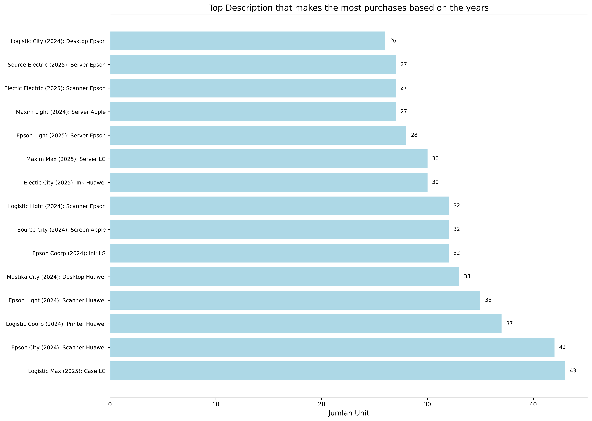

# Data Entry Analysis

Project for analyzing vendor purchase data using Python, Pandas, and Matplotlib.

## Features
- Top vendors per month (in USD $ format).
- Top description per vendor per year with bar chart.
- Charts: See `top_description_yearly.png`.

## How to Run
1. Install: `pip install pandas matplotlib seaborn`.
2. Load data: Edit `df = pd.read_csv('data.csv')` in `analisis_data.py`.
3. Run: `python analisis_data.py`.

## Example Chart

Created with Anaconda environment `data-project`.
